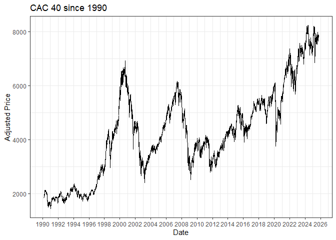
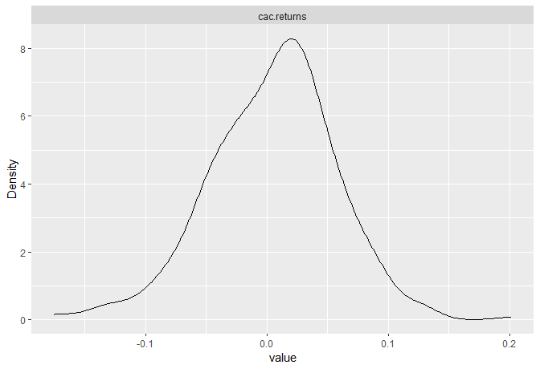

Equity portfolio construction and efficient diversification with climate
risks
================
Pierre Clauss
November 2024

## Foreword

To begin this project, I have to precise the 3 necessary steps for a
data science project:

1.  data: (i) importation, (ii) wrangling and (iii) visualisation (or
    named also *exploratory data analysis*)
2.  modelling
3.  results communication

To achieve these 3 steps, the universe of the package **tidyverse** is
essential for R nowadays.

``` r
library(tidyverse)
```

The first step on data seems often a thankless task but it takes time
(we can estimate it to more than 50% of a data science project) and it
is essential for the success of the project.

The second step is the most grateful for a data scientist. But it is
important to know that the first step and the second one are overlapped:
indeed, when I wrangle or I visualise my data, I often have an idea of
the models I will try.

Finally, the third step is often neglected to a simple ppt, word or tex
document. But it has to be more appreciated with the new tools and this
example of R Markdown document and github website is an attempt to show
you how to communicate better the results of a data science project.

Here, I will focus on the data step to begin well the project.

## 1 Data importation

I import the data from Yahoo Finance with the package **tidyquant**.

``` r
library(tidyquant)

# import data
(cac <- tq_get(
  "^FCHI",
  from = '1990-03-01',
  to = "2024-11-30",
  get = "stock.prices"
))
```

    ## # A tibble: 8,957 × 8
    ##    symbol date        open  high   low close volume adjusted
    ##    <chr>  <date>     <dbl> <dbl> <dbl> <dbl>  <dbl>    <dbl>
    ##  1 ^FCHI  1990-03-01  1836  1838  1827  1832      0     1832
    ##  2 ^FCHI  1990-03-02  1831  1860  1831  1860      0     1860
    ##  3 ^FCHI  1990-03-05  1866  1874  1862  1874      0     1874
    ##  4 ^FCHI  1990-03-06  1869  1875  1866  1872      0     1872
    ##  5 ^FCHI  1990-03-07  1874  1881  1874  1880      0     1880
    ##  6 ^FCHI  1990-03-08  1891  1923  1891  1917      0     1917
    ##  7 ^FCHI  1990-03-09  1936  1941  1921  1921      0     1921
    ##  8 ^FCHI  1990-03-12  1917  1918  1912  1912      0     1912
    ##  9 ^FCHI  1990-03-13  1924  1924  1924  1924      0     1924
    ## 10 ^FCHI  1990-03-14  1919  1946  1919  1946      0     1946
    ## # ℹ 8,947 more rows

``` r
tail(cac)
```

    ## # A tibble: 6 × 8
    ##   symbol date        open  high   low close    volume adjusted
    ##   <chr>  <date>     <dbl> <dbl> <dbl> <dbl>     <dbl>    <dbl>
    ## 1 ^FCHI  2024-10-31 7384. 7393. 7316. 7350. 103047400    7350.
    ## 2 ^FCHI  2024-11-01 7364. 7434. 7358. 7409.  56971200    7409.
    ## 3 ^FCHI  2024-11-04 7386. 7446. 7372. 7372.  45718400    7372.
    ## 4 ^FCHI  2024-11-05 7378. 7415. 7350  7407.  47126000    7407.
    ## 5 ^FCHI  2024-11-06 7444. 7572. 7338. 7370. 108204000    7370.
    ## 6 ^FCHI  2024-11-07 7373. 7450  7354. 7426.         0    7426.

``` r
# plot
cac %>%
  ggplot(aes(x = date, y = adjusted)) +
  geom_line() +
  ggtitle("CAC 40 since 1990") +
  scale_x_date(date_breaks = "2 years", date_labels = "%Y") +
  labs(x = "Date", y = "Adjusted Price") +
  theme_bw()
```

<!-- -->

I will use also economic views to adapt my allocation based on ESG
ratings. I could assume that the future performance of stocks could be
influenced by their ESG ratings: a good ESG rating will lead to good
performance, and a bad one will lead to poor performance. This
assumption could be challenged: see the academic paper by Pastor,
Stambaugh, and Taylor [“Dissecting green
returns”](https://www.nber.org/system/files/working_papers/w28940/w28940.pdf),
where they show that green stocks do not guarantee outperformance
compared to brown stocks.

I use [Sustainalytics’ ESG risk
assessment](https://www.sustainalytics.com/esg-data) to obtain ESG
ratings. These ratings measure the risk to which a company’s value is
exposed due to environmental, social and governance issues. They assess
the risk on an absolute scale from 0 to 100. The lowest score indicates
that ESG risk is the best managed. They are available since 2014 and
published on Yahoo Finance since 2018.

## 2 Data wrangling

The wrangling consists in the storage and the transformation of the
data. “Tidying and transforming are called **wrangling**, because
getting your data in a form that’s natural to work with often feels like
a fight” [R for Data Science](https://r4ds.had.co.nz/introduction.html)
(Grolemund G. and Wickham H.).

I could need, for the project, monthly returns to model on, for
instance.

``` r
# transmute
cac_monthly_returns <- cac %>%
  tq_transmute(
    select     = adjusted,
    mutate_fun = periodReturn,
    period     = "monthly",
    col_rename = "cac.returns"
  )
tail(cac_monthly_returns)
```

    ## # A tibble: 6 × 2
    ##   date       cac.returns
    ##   <date>           <dbl>
    ## 1 2024-06-28   -0.0642  
    ## 2 2024-07-31    0.00696 
    ## 3 2024-08-30    0.0132  
    ## 4 2024-09-30    0.000629
    ## 5 2024-10-31   -0.0374  
    ## 6 2024-11-07    0.0102

We can see below, thanks to the package **DataExplorer**, a summary of
the tidy observed data.

``` r
library(DataExplorer)
plot_intro(cac_monthly_returns)
```

<!-- -->

I can conclude that data are tidy without missing values.

## 3 Data visualisation

Data viz has to be thought in relation with modelling. Then, I am
interested by visualising the distribution of the returns.

Some statistics to sum up the distribution can be shown below: I can
observe symmetric data with a median and a mean which are quite equal.

``` r
summary(cac_monthly_returns)
```

    ##       date             cac.returns       
    ##  Min.   :1990-03-30   Min.   :-0.174903  
    ##  1st Qu.:1998-11-30   1st Qu.:-0.028793  
    ##  Median :2007-07-31   Median : 0.009409  
    ##  Mean   :2007-07-30   Mean   : 0.004769  
    ##  3rd Qu.:2016-03-31   3rd Qu.: 0.037759  
    ##  Max.   :2024-11-07   Max.   : 0.201189

I can go deeper thanks to distribution graphics: the non-parametric
(kernel method) estimation of the distribution and QQ-plots.

``` r
plot_density(cac_monthly_returns)
```

<!-- -->

``` r
plot_qq(cac_monthly_returns)
```

<!-- -->

You are ready now to use financial data!
